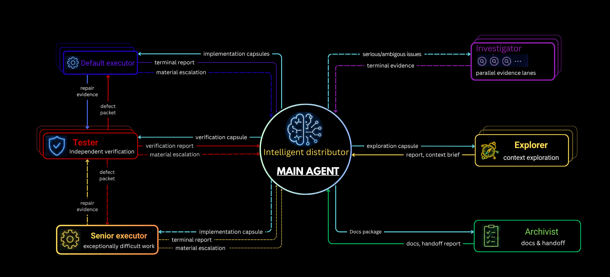

<h3 align="center"><big><big><strong>SIMPLE&emsp;&emsp;───&emsp;&emsp;EASY&emsp;&emsp;───&emsp;&emsp;EFFICIENT</strong></big></big></h3>
<p align="center"><small>&nbsp;&nbsp;&nbsp;&nbsp;&nbsp;&nbsp;&nbsp;(to use)&nbsp;&nbsp;&nbsp;&nbsp;&nbsp;&nbsp;&nbsp;&nbsp;&nbsp;&nbsp;&nbsp;&nbsp;&nbsp;&nbsp;&nbsp;&nbsp;&nbsp;&nbsp;&nbsp;&nbsp;&nbsp;&nbsp;&nbsp;&nbsp;&nbsp;&nbsp;&nbsp;&nbsp;(to install)&nbsp;&nbsp;&nbsp;&nbsp;&nbsp;&nbsp;&nbsp;&nbsp;&nbsp;&nbsp;&nbsp;&nbsp;&nbsp;&nbsp;&nbsp;&nbsp;&nbsp;&nbsp;&nbsp;&nbsp;&nbsp;(token consumption)</small></p>
<hr>


Built for maximum token efficiency: Heavy-route swarm execution with the main
agent as the knowledge director, plus an on-demand persistent Companion for
valuable read-only context work. Workers keep operational evidence in artifacts
and return small knowledge deltas. Medium keeps implementation and verification
in the main agent while retaining cross-session workflow support.

> ⭐ For lightweight tasks, it won’t overdo things. Light route is default.

## 1. Quick installation ⚙️

Requires Python 3.11 or newer for deterministic lifecycle operations.

### Open Codex CLI / Codex app from your project directory 

Change permision to `approve for me/full access`.

▶️ Send:

```text
Download and extract the latest `codex_workflow-<version>.zip` asset (not GitHub's Source code archive) from https://github.com/viettran-edgeAI/codex_workflow/releases. Verify it against `SHA256SUMS`, then read the bundled `codex_workflow/operate/bootstrap.md` and follow it to complete the initial installation.
```
> ⭐ Recommended: use 5.6 Luna xhigh for installation. 

🔄 Restart Codex after installation

The initial bootstrap is complete only after its required `archivist` action
succeeds; restart Codex after both steps. Once that bootstrap is complete, the
current project is ready to use. Whenever you need to install this workflow for
a new project, simply open Codex and send: `codex_workflow --install`

## 2. Workflow usage 

### This workflow has 3 routes:
- Light route : No subagents, no workflow, minimal context.
- Heavy route : Full workflow mode. Deploy production task workers.
- Medium route: Full workflow mode, with implementation and verification kept
  in the main agent rather than delegated to production task workers.

> Full workflow mode enables automatic context and progress management. Both
> routes can create one persistent `Companion` secretary for useful project-
> context work and disposable Investigators for bounded Internet research.
> Both routes use Archivist for documentation and deployment handoffs. Heavy
> additionally delegates production implementation and independent verification.
> On the first deployment-state entry in each session, the main agent reads the
> complete current `agent_docs/` framework directly exactly once; later
> freshness checks may go to Companion.

`agent_docs/` remains Git-trackable: installation does not add it to
`.gitignore`, so durable project context can be versioned and shared normally.

In Medium, the main agent owns implementation and verification. Choose it when
you want workflow-mode context support without delegating production work.

### How to use
- Normally, for simple work, general Q&A, you don't need to do anything. `light route` is the default route.

--------------------------------

- When starting or continuing a plan in progress, tell Codex in the prompt:

```text
use medium/heavy route. [your task description]
```
Or continue a task that was already underway in the previous session: 
```text
use medium/heavy route. Continue ongoing work.
```
Codex stays on the selected route until you change it.
---------------
> **⭐ Recommendation:** Assign very large and complex tasks to the `heavy route` to make the most of its capabilities and maximize token usage savings. Don't hesitate to choose 5.6 Sol xhigh for this route. Using lower reasoning effort will not actually save tokens and will severely reduce its coordination capabilities.

### Coordinating architecture

Medium and Heavy expose capabilities and ownership boundaries through a
hub-and-spoke architecture. The main agent is the central knowledge director,
chooses the task-specific topology, and has a direct bounded relationship with
every worker.



| Role or mechanism | Responsibility | Boundary |
| --- | --- | --- |
| Main agent | Chooses the plan, topology, worker count, ordering, concurrency, repair, verification, and acceptance approach for the actual task. | Retains architecture, scope, material decisions, integration, and final claims. |
| Companion | Maintains project context and performs bounded read-only work in the project ecosystem: repository material, project docs, local modules, dependencies, logs, configuration, Git history, and artifacts. | At most one persistent worker, created when its context work is worth a dispatch; the main retains project decisions. |
| Investigator | Researches any bounded external-information question on the Internet and synthesizes useful sources. | Disposable and read-only; does not take over local project discovery, implementation, or final decisions. |
| Default executor | Discovers, implements, self-checks, and ordinarily repairs one bounded production package. | Receives task-specific project knowledge and guidance from the main. |
| Senior executor | Handles exceptionally difficult mathematical, logical, or cross-cutting work. | It is a limited reserve, not the default production agent. |
| Tester | Independently designs and performs verification from the acceptance intent, risks, and boundaries supplied by the main. | May own assigned test assets, but not production fixes. |
| Archivist | Updates assigned public and project documentation, prepares deployment handoffs, and invokes the Deployment Token Report at closure. | Main owns the project diary; Archivist uses verified facts and read-only Git access. |

Heavy keeps only stable invariants rigid: at most twenty active subagents, at
most one persistent Companion, at most one Senior Executor, direct
main-to-worker coordination, non-overlapping concurrent write ownership, and
one closure reporting owner per substantive deployment. Within those
invariants, the main chooses the investigation, project-context work, repair,
evidence, deployment, and rollback approach appropriate to the task.
Every initial task package has a logical **Task ID**, then three minimal parts
named for the role's work. Executor packages use implementation context, task
and goal, and main-agent implementation guidance; Tester, Investigator,
Companion, and Archivist use corresponding role-specific capsules. The named
parts are complete and their content stays proportional to the package. This
format correlates dispatch and reports, while worker selection, topology,
sequence, and lifecycle remain task-specific decisions of the main. The Tester
normally designs the specific tests from the acceptance context supplied by the
main.

The route recommends batching when independent workers contribute to the same
main-agent decision: dispatch them together, wait for the relevant set, and
synthesize once. Independent main-owned reads and tool checks should likewise
share bounded calls. Apply this rollout-saving scheduling heuristic according
to the task's dependencies and uncertainty.

## Light benchmark


## 3. More details 

Send these exact commands to Codex from the relevant project directory:

| Command | Purpose |
| --- | --- |
| `codex_workflow --install` | Install workflow in the current project and initialize its documentation framework. |
| `codex_workflow --personal` | Add or update project-specific workflow preferences. |
| `codex_workflow --check-update` | Check for a newer release without installing it. |
| `codex_workflow --update` | Download, verify, and install the latest matching release. |
| `codex_workflow --disable` / `codex_workflow --enable` | Disable or re-enable the workflow for the current project. |
| `codex_workflow --remove` | Remove the installed workflow after a destructive dry-run and confirmation. |

For the complete command reference, installed-file map, scripted customization
guide, and Heavy-route design, see [workflow_break_down.md](workflow_break_down.md).
