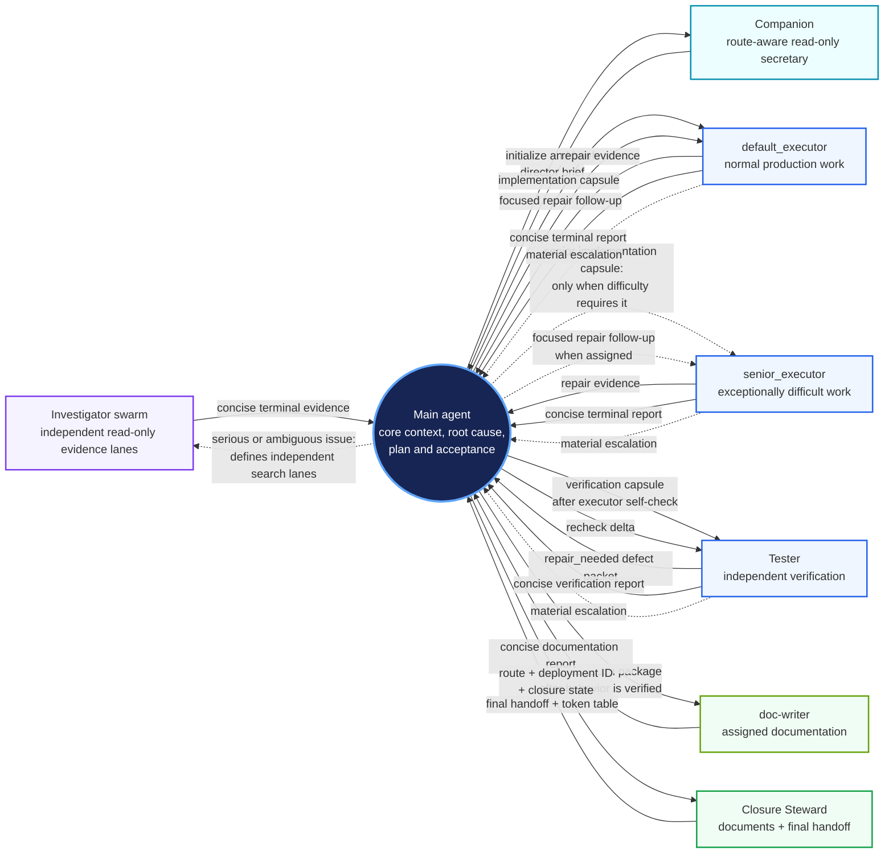

# codex_workflow — Workflow Usage Guide

> This is the maintained user-facing overview. The lifecycle guides and installed
> CLI are authoritative for exact commands and safety behavior.

`codex_workflow` is a modular Codex workflow with explicit responsibility
boundaries, persistent project documentation, shared user-level runtime files,
and conservative lifecycle operations.

This guide is organized into five parts:

1. command prompts and route selection;
2. the installed-file map;
3. built-in definitions and project customization;
4. the shared investigation and Heavy execution model;
5. the component hierarchy and ownership model.

## Part 1 — Command prompts and everyday use

### First-time bootstrap

Open Codex from the project directory and send this prompt:

```text
Download and extract the latest `codex_workflow-<version>.zip` asset (not GitHub's Source code archive) from https://github.com/viettran-edgeAI/codex_workflow/releases. Verify it against `SHA256SUMS`, then read the bundled `codex_workflow/bootstrap.md` and follow it exactly.
```

The release package is a universal ZIP for Linux, macOS, and Windows. Its
installation guide invokes the bundled lifecycle CLI, which owns validation,
rendering, backups, project initialization, and rollback. After the first
installation, start a new Codex session so the newly installed user
instructions are loaded. Python 3.11 or newer is required.

The bootstrap installs the user-level workflow and the current project with the
release's built-in definitions. Project personalization remains an explicit follow-up
command. Bootstrap also adds a marked workflow-owned block to `.gitignore` and
removes a project-level `Codex_Workflow/` extraction directory
once the installation transaction succeeds. Bootstrap then requires one
`doc-writer` action to initialize new or still-template-marked `agent_docs/`
files, or perform a read-only completeness check when the framework is already
healthy. Installation is incomplete until that action succeeds. For listed
context documents, the worker must populate `project_structure.md`,
`project_overview.md`, and `project_core_tech.md` from verified project evidence.

### Exact command prompts

Send each command as its own prompt. The installed lifecycle CLI performs the
validated filesystem operation directly.

#### `codex_workflow --personal`

Interactively personalize the current project. The three supported areas are:

1. Frontend Project Profile, including a project-specific verification profile
   such as reduced frontend testing when that is an intentional decision;
2. Design Principles;
3. Additional Workflow Decisions.

Confirmed decisions are stored in the hidden project resource and materialized
inside the personalization marker in the project's workflow entry point. A
missing or invalid resource is only staged as a recovery proposal until
confirmation; cancellation changes no file. This command does not modify fixed
worker settings or the Project Documentation Framework.

#### `codex_workflow --install`

Install the workflow in the current project after the user-level workflow has
already been bootstrapped:

- creates or preserves the project `AGENTS.md` entry point;
- imports a pre-existing project `AGENTS.md` into the dedicated project-local
  region instead of semantically merging it;
- creates missing files in `agent_docs/` from the six project-document
  templates;
- invokes `doc-writer` to initialize new or still-template-marked documentation,
  while healthy existing installations are a no-op;
- requires listed `project_structure.md`, `project_overview.md`, and
  `project_core_tech.md` recovery or new files to be populated from verified
  project evidence;
- creates the default hidden personalization resource when missing;
- reuses the installed fixed user-level settings.

It does not reinstall or modify any user-level payload under `~/.codex/`, reset
existing project documents, or ask settings and personalization
questions. If the workflow already has an active or disabled project entry
point, the command first validates its state. A healthy active installation is
a no-op; a healthy disabled installation points to `codex_workflow --enable`.
If framework documents are missing or retain bootstrap markers after a failed
documentation action, rerunning `--install` recreates only missing templates
and returns the required recovery action again. Stale, malformed, or conflicted
entry points stop with an actionable error.

#### `codex_workflow --update`

Update the installed workflow and the recognized current project from a GitHub
Release asset. The command queries the GitHub Releases API, selects the latest
semantic-versioned release with the matching ZIP and checksum,
downloads the asset, verifies it, and extracts it into a temporary directory.
It never clones or pulls the repository.

The update applies the incoming release's fixed definitions and regenerates
distributed worker TOMLs. It preserves
project personalization, project-local instructions, project documents,
unrelated Codex settings, source backups, and the project's enabled or disabled
state. Projects on older workflow versions
are validated against their matching historical source backups. It stops on
marker drift, unavailable historical source, or legacy edits requiring a
one-time reviewed project-entry migration. Obsolete workflow-owned files and
worker roles are removed from the installed manifest.

#### `codex_workflow --check-update`

Run an explicit read-only release check. It queries the available installable
releases and reports every version newer than the installed one with a compact
summary of each release's notes. It does not download or change files.

#### `codex_workflow --remove`

Remove the installed workflow in two phases. The first invocation creates a
read-only destructive summary and warns the user. Only after one explicit
second confirmation does the lifecycle CLI remove the project workflow wrapper,
project workflow resource, user-managed workflow region, workflow-owned Codex
settings and workers, and the complete installed runtime including backups. It
restores the entry point's project-local instructions, removes marked
workflow-owned `.gitignore` rules, and preserves `agent_docs/` and unrelated
user-level content. A non-affirmative response performs no changes.

#### `codex_workflow --disable`

Disable the workflow for the current project by moving the active entry point:

```text
AGENTS.md -> .codex_workflow_hidden_resources/.AGENTS.md
```

The contents, personalization resource, project documents, and user-level
workflow remain intact. The operation is a safe no-op when the project is
already disabled.

#### `codex_workflow --enable`

Re-enable a disabled project by moving the entry point back:

```text
.codex_workflow_hidden_resources/.AGENTS.md -> AGENTS.md
```

This changes only the active/disabled entry-point state. It does not reapply
fixed definitions or personalization.

### Route selection and deployment closure

There are three execution routes:

- **Light route** — the default; the main agent works alone with minimal
  workflow overhead.
- **Medium route** — the main agent performs root-cause analysis,
  implementation, and verification without delegated production executor or
  tester packages. Medium Companion handles routine context support. An
  explicitly requested read-only evidence wave may assist, but it never owns
  implementation, verification, or the root-cause decision.
- **Heavy route** — the main agent orchestrates fixed worker subagents for
  larger deployment-state tasks. Heavy Companion provides continuing clerical
  discovery, indexing, conflict checking, mapping, aggregation, packaging, and
  optional readiness support.

For ordinary questions and small tasks, no route command is needed. To select
a route for a task or plan, include one of these instructions in the prompt:

```text
use medium route. [task description]
use heavy route. [task description]
```

The selected route is session-scoped: it remains active until the user changes it
or the session ends. New sessions default to Light unless a route is selected
again. Medium and Heavy reuse one Companion; a route change sends it an explicit
transition brief and deactivates its previous route-specific duties. Each
substantive Medium or Heavy deployment automatically creates a
workflow-owned documentation handoff before its final response. Its fresh Luna
xhigh worker receives the fixed finite handoff context and alone reconciles the
complete `agent_docs/` framework, reports read-only Git status and handoff
information, then directly invokes the installed `$deployment-token-report`
skill. Closure Steward returns a six-column table for every used worker role
and the main agent: quantity, rollouts, cached input, total input, and output
tokens. The main agent waits for that single handoff and prints the table
without another dispatch. No worker stages or commits automatically, and no
separate main-maintained usage summary is required. Questions and small or odd bounded
tasks use the direct worker-free path and emit no table.

## Part 2 — Installed-file map

The release ZIP contains only one top-level directory, `codex_workflow/`. It
does not contain the repository README, README images, development documents,
`.git/`, release scripts, or other repository-only files. On Windows, `~/.codex`
means the current user's profile directory and the platform's normal path
separator is used.

After installation, the runtime is distributed between the user environment
and the current project as follows:

```text
~/.codex/
├── AGENTS.md                              # user-level command interface
├── config.toml                            # existing Codex config; only workflow-owned keys are managed
├── agents/                                # all distributed workflow worker TOMLs
│   ├── default_executor.toml
│   ├── senior_executor.toml
│   ├── tester.toml
│   ├── doc-writer.toml
│   ├── companion.toml
│   ├── investigator.toml
│   └── closure_steward.toml
├── skills/
│   └── deployment-token-report/
│       ├── SKILL.md                        # Closure reporting procedure
│       ├── agents/openai.yaml              # skill UI metadata
│       └── scripts/report_tokens.py        # read-only rollout parser
└── codex_workflow/
    ├── VERSION                             # installed workflow version
    ├── user_AGENTS.md                      # managed command interface
    ├── workflow.py                         # validated lifecycle CLI
    ├── runtime/                            # validation, rendering, release, and transaction modules
    ├── resources/                          # immutable package defaults
    │   └── personalization.md
    ├── install_state.json                  # ownership and version
    ├── heavy_route.md                      # Heavy-route orchestration rules
    ├── medium_route.md                     # Medium-route rules
    ├── medium_companion.md                 # Medium secretary contract
    ├── heavy_companion.md                  # Heavy orchestration-secretary contract
    ├── investigation_team.md               # Heavy or explicitly requested Medium evidence and root-cause gates
    ├── closure_steward.md                   # shared closure spawn contract
    ├── bootstrap.md                        # initial user/project bootstrap procedure
    ├── install.md                          # project-only installation procedure
    ├── update.md                           # Release-based update procedure
    ├── check_update.md                     # explicit read-only release check
    ├── remove.md                            # two-phase removal procedure
    ├── personalization_guide.md            # --personal procedure
    ├── disable.md                          # --disable procedure
    ├── enable.md                            # --enable procedure
    ├── templates/
    │   ├── AGENTS.md                       # project entry-point template
    │   ├── agents/*.toml                    # all distributed worker templates
    │   ├── project_docs/*.md                # six Project Documentation templates
    │   └── skills/deployment-token-report/  # canonical installed skill template
    ├── .source_backup/<version>/            # complete installed release source backup
    └── .backups/<old-version>-<timestamp>/ # update backups, created when needed

<project>/
├── AGENTS.md                               # active project workflow entry point
├── .gitignore                               # marked workflow-owned paths are ignored
├── agent_docs/
│   ├── project_overview.md
│   ├── project_core_tech.md
│   ├── project_structure.md
│   ├── project_progress.md
│   ├── project_diary.md
│   └── latest_session_work.md
└── .codex_workflow_hidden_resources/
    ├── personalization.md                  # project-scoped private resource
    ├── state.json                          # project entry-format and activation state
    └── .AGENTS.md                          # disabled entry point; mutually exclusive with root AGENTS.md
```

The last two project entry-point files are mutually exclusive: an enabled
project has `AGENTS.md`; a disabled project has the hidden `.AGENTS.md`. The
hidden directory is also where project personalization is kept so it is not
mistaken for ordinary project documentation.

The six files under `agent_docs/` have different ownership and purposes:

- `project_overview.md` — goals, architecture, workflow, and major decisions;
- `project_core_tech.md` — important technologies and architectural constraints;
- `project_structure.md` — layout, modules, ownership, and boundaries;
- `project_progress.md` — concise overall progress and current milestone;
- `project_diary.md` — compact accumulated project experience: durable
  decisions, discarded approaches, mistakes, and reusable lessons that prevent
  repeated errors;
- `latest_session_work.md` — the latest deployment state, evidence, outcome,
  unfinished work when present, and continuation point.

## Part 3 — Built-in definitions and customization

Command prompts select an operation. The lifecycle CLI validates and
materializes all generated surfaces from their source resources.

### Fixed workflow definitions

There is no workflow settings file or installed tuning surface. Behavior lives
directly in the release files that own it: worker TOMLs own models and report
contracts, route documents own orchestration limits, and
`runtime/platform_settings.py` owns the Codex platform keys. Install and update
copy those definitions exactly.

The current built-ins are `default_executor`, `senior_executor`, `tester`,
`doc-writer`, `companion`, `investigator`, and
`closure_steward`. The first three are Heavy production/verification roles.
`doc-writer` and Closure Steward own documentation updates; Companion and
investigator provide read-only workflow support. The default executor uses `max`; Heavy permits at
most one senior executor; and the Codex child-worker ceiling is twenty.

All listed roles are fixed built-in definitions. Companion is the single
persistent secretary and office wrapper: it handles routine read-only work and
retains operational context. Every worker reports directly to the main, which
launches, waits for, and collects coherent groups without an inference parent.
Multiple investigator task names may use the
one read-only investigator definition for Heavy evidence lanes or an explicitly
requested Medium evidence wave.

Bootstrap and update enable the documented multi-agent settings under `[agents]`
and `[features]`. They remove workflow-owned legacy V2 keys instead of
generating an undocumented feature gate.

When worker definitions or platform settings change, open a new Codex session
so the updated settings are loaded.

Changing a built-in definition or worker requires changing the package source,
tests, and release together. Installed retuning is unsupported.

### Tuning project personalization

The private source resource is:

```text
.codex_workflow_hidden_resources/personalization.md
```

It contains the confirmed Frontend Project Profile, Design Principles, and
Additional Workflow Decisions. Its decisions are materialized only inside the
marked personalization block in `AGENTS.md` (or the hidden entry point while
the project is disabled).

Do not edit its materialized marker directly. `codex_workflow --personal`
validates a complete candidate and atomically updates the resource and generated
region while preserving project-local instructions.

Do not put personalization in `agent_docs/`: those six files are durable
project context and are intentionally available to the normal workflow.

### Customizing routes and documentation

Advanced route changes belong in a maintained source package or fork, not in an
installed generated copy that update will replace:

```text
~/.codex/codex_workflow/heavy_route.md
~/.codex/codex_workflow/medium_route.md
~/.codex/codex_workflow/investigation_team.md
```

Possible customizations include:

- replacing `project_progress.md` with a dedicated codebase navigation or
  management tool for a very large repository;
- adapting the `closure_steward` worker instruction to the project's
  documentation or review practice while retaining its read-only Git handoff
  and keeping `closure_steward.md` as the spawn contract.

Keep the route's ownership boundaries, fixed worker limits, verification gates, and
single-worker automatic-closure ownership of the complete documentation
framework. After a source change, verify that the settings resource, route
contracts, and worker definitions still agree.

## Part 4 — Workflow-mode support and Heavy execution

Medium keeps planning, root-cause analysis, implementation, and verification in
the main agent. Its route guide activates one persistent Companion for routine
read-only context work; it does not create delegated production packages. If the user
explicitly requests independent evidence lanes, read-only investigators may
assist, but the main agent still opens decisive evidence and owns the root-cause
decision. Heavy's route guide reuses that worker as an orchestration secretary
and adds delegated production and testing packages after that gate.

The Heavy route is an orchestrated deployment-state workflow. It is selected
explicitly by the user; Light remains the default for small tasks. The Heavy
route does not mean that every prompt must spawn workers: common questions and
small tasks use a direct main-agent fast path and must not call subagents. When
that fast path calls no subagent, its final response also omits the worker
token table.

### Coordination flowchart



### Roles and ownership

The fixed role set is:

| Role | Responsibility | Can edit project source? |
| --- | --- | --- |
| Main agent | Knowledge architect: chooses scope and architecture, defines and evaluates gates, distributes guidance, and integrates knowledge | Only for decision-critical inspection or exceptional scoped takeover, not routine Heavy implementation or operational verification |
| `default_executor` | Package discovery, production implementation, self-check, and routine repair | Yes, within its work package |
| `senior_executor` | Complex core reasoning or exceptionally difficult cross-cutting implementation | Yes, within its work package; fixed to at most one instance |
| `tester` | Independent tests, evidence-manifest rows, and failure analysis | Test/fixture scope; returns production defect packets to the main for routing |
| `doc-writer` | Verified public/product/operator/service docs and required installation initialization | Outside `agent_docs/`, except listed bootstrap recovery files |
| Companion | Medium context secretary or Heavy orchestration secretary | No; one persistent route-aware worker for continuing clerical work |
| `investigator` | Disposable Luna leaf agent for one bounded code, evidence, dependency, documentation, log, or external-solution lane | No |
| `closure_steward` | Reconciles `agent_docs/`, evidence-manifest disposition, Git status/handoff, and token report | No edits outside `agent_docs/`; no Git mutation |

The role names are stable while their model bindings live only in the worker
TOMLs. The package settings, route contracts, and worker definitions jointly
encode the fixed role list and limits; no route block is generated.

### Context loading and work-package flow

When Heavy is selected for a deployment-state task, the main agent:

1. reads the project entry point, route instructions, `project_overview.md`,
   `project_core_tech.md`, `project_structure.md`, `project_progress.md`, and
   `latest_session_work.md`, then initializes or transitions one read-only Heavy
   Companion;
2. Companion reads `project_diary.md` and every module-specific Markdown
   document, returns a task-related director brief with exact references and
   module-document coverage, and retains the supporting detail;
3. uses the brief and bounded Companion indexing, conflict checking, integration
   mapping, environment/tool inventories, and status aggregation to target exact
   task-critical documentation, source, contracts, and evidence;
4. for a serious or ambiguous issue, dispatches orthogonal read-only
   investigator lanes under the shared investigation contract;
5. directly waits for and collects every expected investigator report, then
   evaluates the complete set once, opens decisive sources, and identifies the
   actual defect through the main-owned root-cause gate;
6. forms architecture, ownership, acceptance, and a lightweight evidence
   manifest whose gates are required, conditional, or advisory;
7. optionally asks Companion to format main-owned decisions or audit ownership
   and evidence metadata, approves the result, then sends role-specific packages.

Every worker gets a minimal routing envelope. Executor capsules add only
package-specific decisions, ordered guidance, interfaces, invariants, risks,
and acceptance; generic policy stays in the worker definition. Testers receive
criteria, checked scope, risks, evidence, and the repair target. Other roles
receive short briefs. Full evidence stays in artifacts.

The normal implementation and verification loop is:

```text
User selects Heavy route
        │
        ▼
Main reads five non-diary core documents; Companion reads diary + module docs
        │
        ▼
Companion returns a task-related brief; main frames lanes from the split intake
        │
        ▼
Main launches investigators directly and collects the complete expected report set
        │
        ▼
Main inspects decisive sources and passes the root-cause gate
        │
        ▼
Main forms architecture and distributes guidance-rich package(s)
        │
        ▼
Executor implements one coherent increment and self-validates
        │
        ▼
Tester independently runs focused checks when testing is warranted
        │
        ├── routine defect ──► main-routed executor repair ──► tester recheck
        ├── proof ─────────► concise terminal report to main
        └── decision defect ─► main agent re-scopes or decides
        │
        ▼
Main integrates verified package outcomes
        │
        ▼
Main evaluates the lightweight evidence manifest and residual risk
        │
        ▼
Fresh Luna xhigh worker automatically closes the deployment before the final response
```

The tester is a leaf verifier. It returns a `repair_needed` defect packet to the
main, which forwards it unchanged to the responsible executor through a focused
follow-up or creates a fresh repair executor when reuse is unsafe. After
collecting repair evidence, the main reactivates the tester with only the delta
and affected regression boundary. Test and fixture defects stay with the tester;
material or repeated defects escalate for a main-owned decision.

Workers keep raw output in artifacts and return small direct knowledge deltas.
At each gate, the main starts with the owning contract, decisive source, and
decisive failure or verification artifact, expanding only for risk or conflict.

In Heavy, owning acceptance and integration gates means defining the gate,
assigning its execution, evaluating the returned evidence, and deciding
acceptance. It does not mean repeating checks that an executor or tester already
proved. Deployment state, public endpoints, uploads, browser and screenshot
work, external search, routine Git or status collation, tool or API discovery,
and operational diagnostics stay with the responsible worker.

If an integration check genuinely cannot be delegated, the main agent first
resolves the exact operation and combines all already-known independent reads
and checks into one bounded tool turn. Unless the result crosses a material
decision or escalation boundary, a failure or ambiguous result goes back to the
responsible worker with the new evidence instead of starting a main-agent
diagnostic chain.

The evidence manifest keeps independent gates separate and records criterion,
class, owner, status, method/artifact, checked scope/freshness, and limitation.
Browser, screenshot, or OCR tooling failures are `unavailable`, not product
failures, and cannot erase passed backend gates. They block only when that exact
observation is required and no reliable alternative exists.

Rollback compares the candidate with the actual public baseline. It is used for
a confirmed material regression, safety/data risk, or required-contract failure
only when the prior state is safer or more functional. A failed screenshot,
blank OCR result, advisory visual defect, or unavailable conditional check does
not trigger rollback. If the prior baseline is an outage and the candidate
restores core service, preserve the best recoverable state while non-blocking
defects are repaired unless a safety boundary or explicit user requirement says
otherwise.

### Concurrency and communication controls

The fixed platform and route definitions permit at most twenty concurrent child
workers and at most one `senior_executor` instance. Companion is a persistent
workflow companion rather than a production task worker, but its live thread
consumes capacity. Investigator quantity follows useful independent search
breadth rather than token-cost minimization and is a Heavy concern unless
Medium evidence support is explicitly requested. Both routes keep one
child-agent slot available for the fresh Closure Steward worker and must not
exceed the fixed role or worker limits.

Worker communication is event-driven. The main directly launches each worker,
waits for lifecycle events, collects the expected terminal reports, and
integrates a coherent group once. Tester and executor roles are leaves: the main
forwards routine defect and repair deltas without re-diagnosing them.
Evidence-free work gets one retry, then replacement or a narrowly scoped
main-agent takeover.

Task workers do not edit Git state or shared status documents. Public-doc
workers stay outside `agent_docs/`; Closure Steward alone edits `agent_docs/`
and reports read-only Git state. Companion and investigators remain read-only.

### Cross-session continuity

`project_progress.md` carries only the goal, overall progress, current position,
and next milestone. `latest_session_work.md` carries the most recent deployment
outcome, verification, blockers, and exact continuation point. A completed
deployment remains recorded concisely instead of clearing both files.

At the first substantive Medium deployment in a session, Companion reads
`project_diary.md` and returns the deployment marker plus a task-related
director brief; the main otherwise loads documentation selectively. At the
first substantive Heavy entry, the main reads the five core documents other
than `project_diary.md`, while Companion reads and summarizes the diary and
every module-specific Markdown document. This Heavy split intake also runs on a
Medium-to-Heavy transition. Later Heavy deployments or re-entry reuse retained
context and refresh only what changed or controls a decision.

Before each substantive Medium or Heavy deployment returns its final response,
the route automatically creates a fresh, uniquely named `closure_steward` worker
with the handoff contract's finite context fork. This preserves its Luna xhigh
model while inheriting recent main-agent context. Without a parent-built capsule,
it reconciles `agent_docs/`, consumes Heavy's lightweight evidence manifest,
performs compact checks, and reports read-only Git state. It never
edits public docs or Git. After sealing that work, it directly invokes the
installed `$deployment-token-report` skill for the same deployment ID. The
skill resolves the Steward's parent thread and the exact Companion deployment
marker from rollout metadata and returns exactly six columns: `Agent`,
`Quantity` (distinct task names),
`Rollouts`, `Cached input`, `Input`, and `Output`. The main agent prints the
table without another dispatch. The cutoff is when the parser starts, so the
Steward's short final response is intentionally outside the totals. Direct
questions and small or odd bounded tasks create no worker, handoff, or table.

## Part 5 — Component hierarchy and ownership

The original design grouped the system into five logical blocks across two
geographical levels. That model remains useful, but some paths need a precise
distinction: `agent_docs/` is project documentation, while personalization is
private under `.codex_workflow_hidden_resources/` and Heavy acceptance evidence
stays in the deployment's lightweight working manifest;
worker TOMLs are materialized runtime definitions, while `install_state.json`
tracks lifecycle ownership and version.

The five blocks are:

### 1. Workflow runtime — user level

Location: `~/.codex/`

- `~/.codex/agents/` contains all distributed worker TOMLs. The fixed role set
  is `default_executor`, `senior_executor`, `tester`, `doc-writer`,
  `companion`, `investigator`, and `closure_steward`.
- `~/.codex/skills/deployment-token-report/` contains the workflow-owned skill
  and deterministic read-only rollout parser. Bootstrap, update, backup, and
  removal track it separately from unrelated personal skills.
- `companion.toml` documents an optional 520,000-token context window with
  automatic compaction at 450,000 tokens; the override is scoped to
  that role.
- `investigator.toml` defines the disposable read-only Luna xhigh leaf role used
  by Heavy, or by an explicitly requested Medium evidence wave.
- `~/.codex/codex_workflow/heavy_route.md` defines Heavy orchestration,
  delegation, limits, repair loops, and ownership.
- `~/.codex/codex_workflow/medium_route.md` defines main-agent execution with
  Companion workflow support, optional read-only evidence, and documentation
  closure; it does not delegate production implementation or verification.
- `~/.codex/codex_workflow/medium_companion.md` defines routine Medium context
  support; `heavy_companion.md` adds continuing source/contract indexing,
  document and integration mapping, environment/tool inventory, evidence-owner
  tracking, capsule formatting, and readiness support. Shared lifecycle and
  authority stay in `AGENTS.md` and `companion.toml`.
- `~/.codex/codex_workflow/investigation_team.md` defines the shared dispatch,
  evidence, main-agent context, and root-cause gates.
- `~/.codex/codex_workflow/closure_steward.md` defines the shared spawn contract;
  `closure_steward.toml` contains the complete handoff procedure.

This block is the reusable execution machinery. It is shared by projects and
does not contain project-specific decisions.

### 2. Workflow integration — project level

Location: the current project directory

- `AGENTS.md` is the active project entry point and contains the workflow
  instructions materialized for this project.
- `agent_docs/` contains the six-document Project Documentation Framework.
- `.codex_workflow_hidden_resources/.AGENTS.md` is the same entry point in its
  disabled state and must not coexist with root `AGENTS.md`.

This block connects the shared runtime to one project. Its project documents
are durable context, not private configuration.

### 3. Fixed definitions — user level

The release-owned surfaces are:

- `~/.codex/agents/*.toml`: materialized definitions for all distributed workers;
- `~/.codex/config.toml`: workflow-owned Codex platform settings, merged into
  the user's existing configuration without replacing unrelated settings;
- `~/.codex/codex_workflow/heavy_route.md` and the other contracts: orchestration
  limits and role interaction rules;
- `~/.codex/codex_workflow/templates/agents/`: all distributed worker
  templates, with model bindings isolated inside their semantic role files.

No aggregate workflow-settings document is generated. Update replaces these
release-owned definitions.

### 4. Personalization — project level

Private resource:

```text
.codex_workflow_hidden_resources/personalization.md
```

It contains the confirmed project-scoped decisions:

1. **Frontend Project Profile** — for example, a deliberate reduced frontend
   verification profile;
2. **Design Principles** — project-specific design and engineering rules;
3. **Additional Workflow Decisions** — other confirmed project instructions.

The resource is intentionally hidden from ordinary project context. Its
effective instructions are materialized between the personalization markers
in `AGENTS.md` or in the hidden disabled entry point. It is not stored in
`agent_docs/`, and `agent_docs/` should not be used as a substitute for it.

### 5. Guidance and lifecycle control — user level

Location: `~/.codex/codex_workflow/`

- `user_AGENTS.md` contains the workflow marker, installed version marker, and
  exact command prompts for `--install`, `--update`, `--check-update`,
  `--remove`, `--personal`, `--disable`, and `--enable`.
- `bootstrap.md`, `install.md`, and `personalization_guide.md` describe initial
  bootstrap, project installation, and personalization.
- `update.md`, `disable.md`, and `enable.md` describe update and activation
  lifecycle operations.
- `remove.md` describes the destructive two-phase removal procedure.
- `workflow.py` and `runtime/` implement validated lifecycle operations.
- `VERSION` identifies the installed workflow version.
- `templates/` stores the project entry-point, worker, and project-document
  templates used for installation and update.
- `.source_backup/` keeps a complete release source copy for repair and
  recovery; update-time `.backups/` preserve replaced installed state.

This block is the command and lifecycle control plane. Guides define intent and
the runtime performs deterministic mutations. It is not project context or the
worker execution layer.

These five blocks are logical ownership boundaries, not five disjoint
directories. For example, `~/.codex/codex_workflow/` hosts routes, guidance,
fixed definitions, templates, and backups. The distinction is about who owns the
data and how it is consumed:

```text
User level:    shared runtime + fixed definitions + lifecycle guidance
                    │
                    │ materialized into the current project
                    ▼
Project level: entry point + six durable documents + private personalization
```
