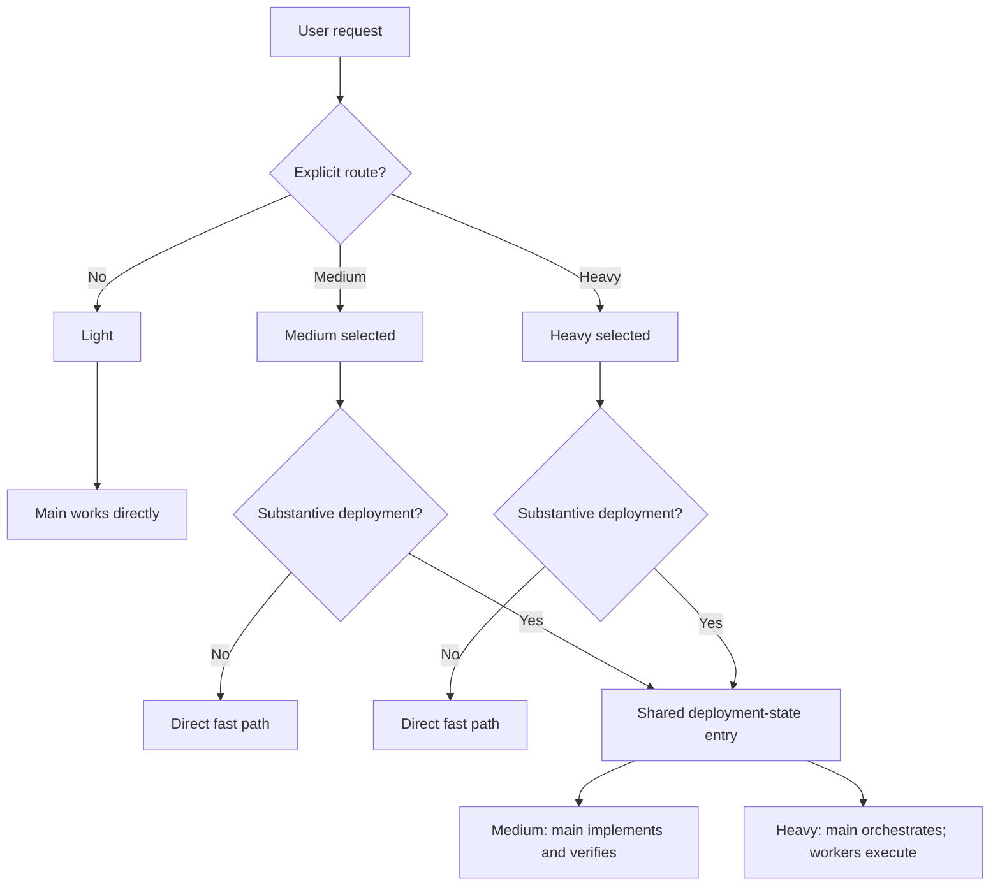
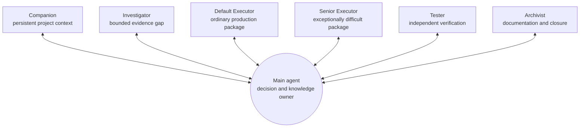

# codex_workflow — Architecture and Operational Analysis

This document is a current-state analysis of `codex_workflow`: its goals,
route model, agent topology, durable context system, lifecycle runtime, safety
properties, release process, and extension boundaries. It analyzes the source
package represented by `codex_workflow/`; it is not an additional executable
instruction surface.

For exact behavior, use the source that owns the relevant contract:

- `codex_workflow/AGENTS.md` for shared project behavior, route selection, and
  first deployment-state entry;
- `codex_workflow/medium_route.md` and `codex_workflow/heavy_route.md` for
  route-specific orchestration;
- `codex_workflow/agents/*.toml` for worker models, permissions, and role
  boundaries;
- `codex_workflow/archivist.md` for documentation assignments and deployment
  closure;
- `codex_workflow/operate/*.md` for user-facing lifecycle procedures;
- `codex_workflow/runtime/*.py` for deterministic lifecycle mutations; and
- `codex_workflow/skills/deployment-token-report/` for deployment usage
  reporting.

This revision was reviewed against packaged version `1.1.17-patch.1`, read from
`codex_workflow/operate/VERSION`. Version markers, package validation, and
release tests prevent that value from drifting from the distributed user
instruction block.

## 0. A Deep Dive into Codex Orchestration


### You Can't Just Tell the Main Agent to Delegate Everything

We can't simply tell the main agent:

> "Hey Sol, make a plan for this task and delegate the implementation to Luna subagents."

There are several aspects that need to be balanced carefully.

### Main-agent control vs. context savings and task completion

- How much of the codebase should the main agent load itself?
- Should it personally review the output of tests performed by testers?
- Should it inspect logs and reports to understand what the subagents are doing, or let them work independently and simply accept their final results?

### Main-agent rollouts vs. worker rollouts

In Codex, every time a model stops to call a tool, coordinate a subagent, etc., it consumes another rollout.
And each rollout reloads the model's entire context, although most of that will usually be cached input tokens.
So every time the main agent calls or coordinates a worker, that also costs a main-agent rollout.

This means that overly fine-grained coordination with workers, repeatedly retrieving context reports from the Companion, and similar operations can sometimes become counterproductive from a token-cost perspective.

You may successfully move some work to a worker, but in exchange, the main agent has to reload its entire context.
In practice, you're basically trading **cached input tokens from the main agent** for **input/output tokens from workers**.
And the main agent is roughly **40x/100x more expensive than the workers** depending on whether you're using Sol/Astra vs. Luna.

This is why I apply **batching guidelines** to reduce the number of main-agent rollouts. I'll explain them later in the `codex_workflow` design section.
AI isn't going to naturally balance all of these trade-offs for you. You have to experiment, measure, observe, and optimize the workflow yourself.

That's also why I added end-of-session token statistics through the built-in workflow skill:


---

## Why Not Just Ask Codex to Design an Efficient Orchestration Framework?

Why not simply ask Codex to propose an orchestration architecture that is both efficient and actually feasible on the platform?
There are several problems.

### 1. Perspective and awareness

There are three different levels of perspective:

- the workflow designer
- the main agent
- the workers

The AI doesn't naturally distinguish these perspectives correctly when writing instructions.
When you ask it to write the instructions itself, it tends to write them from the **workflow designer's perspective**.
For example, an older revision of `archivist.toml` contained instructions like:

> “For bootstrap or installation, initialize only the listed new or still-template-marked documents... This initialization authority ends with that assignment.”

That's written from the perspective of the workflow designer.
But the worker — the Archivist in this case — doesn't actually know the surrounding context implied by those instructions.

The instruction needs to be written from the worker's point of view and provide the necessary context, such as explaining the install/bootstrap process and the main task being assigned to it.

### 2. "Optimization" has no fixed finish line

If you tell an AI:

> "Optimize this orchestration workflow to minimize cost while still ensuring that tasks can be completed reliably."

and then give it a few test projects so it can repeatedly evaluate and improve itself, it will keep optimizing endlessly.

Eventually, the workflow starts becoming **over-optimized for the test cases**, while the orchestration framework becomes increasingly rigid and formulaic.
I've already gone through this. At one point, it proposed this design:

- `wave_barrier` as an intermediary LLM coordinator

The idea was to introduce an intermediary subagent.

The Main Agent would send it the manifest for an entire wave. The barrier would spawn the workers, absorb their completion wakeups, wait for the entire child tree to finish, and then return a single terminal bundle to the Main Agent.

In theory, this would reduce the number of times the Main Agent gets woken up.

But in practice, it added another layer of LLM orchestration, made the topology more complicated, forced the architecture around explicit waves, and wasn't even feasible on the platform because `wave_barrier` couldn't directly communicate with those workers.

Eventually, I had to tear the whole thing down myself and return to a much simpler design philosophy:

**Describe the workers, let the Main Agent control the orchestration itself, and provide a set of optimization guidelines.**

### 3. Accumulated patches in instructions

Another issue is the accumulation of revisions.
For example, when an old guideline becomes obsolete, the AI tends to add something like:
> "Do not use XYZ."
instead of restructuring the instructions and removing the outdated part entirely.
Over time, these patches accumulate.
There are plenty of other small problems like this that I don't remember anymore, but these are the major ones that stood out.

---

## Platform Feasibility

There were also several ideas that I came up with myself that sounded great in theory but simply weren't feasible on the platform.

### 1. The original Explorer Companion idea

The original idea behind the Explorer Companion — now just called the **Companion** — was for it to handle miscellaneous work, receive reports from workers, consolidate them, and send the result back to the Main Agent.

But it turns out that it can't directly receive reports from those workers because they're all subagents.

### 2. Inheriting the Main Agent's context

Some roles benefit greatly from seeing the Main Agent's recent context.

For example, the Archivist closing a deployment needs to know what changes were verified, the current state of the project, and the next entry point so it can update the documentation correctly.

But using a different model doesn't mean you can infinitely copy the entire conversation history into it.

In the current implementation, workers normally start with:

`fork_turns="none"`

and receive explicit context capsules.
For closure, the Archivist can instead be created with a finite recent-context fork, currently:

`fork_turns="200"`

if that recent history is useful as documentation context.

---

There have been many times when I thought:

*"Okay, this version is done. Everything makes sense now."*

Then I tested it, watched how the workflow actually behaved, looked at the statistics...

...and ended up changing it again.

And again.

And again.

Until the design actually worked well **in practice**, rather than only making sense in my imagination.

---

The coordination process roughly works like this:

**Main Agent receives the task**
→ reads `agent_docs/` to build a comprehensive understanding of the project's context, architecture, and timeline
→ identifies critical parts of the codebase and reads them itself, while deploying the `Companion` and `Investigator` workers when needed
→ plans the work and divides it into bounded tasks
→ each worker receives a work package containing the context scope, task, goal, and a knowledge package with project-specific guidance
→ at substantive deployment closure, `agent_docs/` is updated, the Git handoff is completed, and the integrated `$deployment-token-report` is generated.

Here's an example of the token-usage report generated at the end of each Heavy-route deployment:


In this design, the **Companion** helps reduce context pressure on the Main Agent.

Together with the **Investigators**, it offloads work that does not require the Main Agent's high intelligence, allowing the Main Agent to remain focused on orchestration, high-level reasoning, and critical decisions without being distracted by lower-value operational work.

Each work package contains instructions enriched with knowledge distilled from the Main Agent, benefiting from its broad understanding of the overall task and project context.

Each **Default Executor** can therefore focus on a compact, well-scoped package of work.

**This fork uses Astra medium for bounded Default Executor work.**

The **Senior Executor** acts as a fallback for exceptionally difficult problems where stronger reasoning is required.

## Batching Guidelines

The workflow's **batching guidelines** came from extensive experimentation.

They are designed to group related coordination and execution work more efficiently, significantly reducing the number of Main Agent rollouts and the repeated context replay associated with them.

Basically, they're scheduling rules:

- Independent workers that contribute to the same decision should be dispatched together.
- The Main Agent waits for the relevant group of results and synthesizes them once.
- The next batch should only be opened when evidence from the previous batch actually changes the next question.
- Independent implementation packages without overlapping write ownership can run in parallel.
- Dependencies, overlapping mutations, uncertainty, or high-risk work should still run sequentially.
- Don't poll workers, request status-only updates, or ask for evidence that has already been provided.
- Normal operational failures should go back to the appropriate owner for repair. The Main Agent only intervenes when a new decision is required.
- Independent read/search/check operations performed by the Main Agent should also be grouped into a sensible tool turn.

## 1. Executive summary

`codex_workflow` is two related systems distributed in one release:

1. An agent-orchestration contract with Light, Medium, and Heavy routes.
2. A deterministic installer and lifecycle runtime that materializes that
   contract at user and project scope without taking ownership of unrelated
   content.

The route design uses the main agent as the decision owner and makes delegation
proportional to the task:

| Route | Production and verification owner | Supporting topology | Intended use |
| --- | --- | --- | --- |
| Light | Main agent | None | Questions and small bounded work with minimal overhead |
| Medium | Main agent | Required persistent Companion in deployment state; optional Investigators; Archivist for documentation and closure | Substantive work that benefits from durable context and support but must keep implementation and verification in the main |
| Heavy | Executors own production and repair; Tester owns independent verification | Required persistent Companion; optional Investigators, Default Executors, one Senior Executor, Testers, and Archivists | Large or complex work that can be decomposed while the main retains architecture, integration, and acceptance authority |

The optimization target is not the fewest total tokens across all agents. It is
lower main-agent context consumption and fewer main-agent decision turns while
preserving understanding, quality, and task completion. Cheap workers absorb
bounded reading, execution, and evidence preparation; the main spends its
capacity on decisions whose quality depends on a broad project view.

Four properties define the architecture:

- **Explicit ownership.** Each role has a narrow decision and mutation surface.
- **Knowledge distribution.** Executor packages carry the main agent's relevant
  facts, rationale, contracts, constraints, and guidance, not merely a task
  label.
- **Durable continuity.** `agent_docs/` stores compact project knowledge and a
  recoverable cross-session continuation point.
- **Conservative lifecycle management.** Installation, update, enable/disable,
  personalization, and removal operate on recognized files and marked regions,
  validate before writing, and compensate on failure.

## 2. Design goals and non-goals

### 2.1 Primary goals

- Preserve the main agent's technical judgment while moving bounded operational
  work to less expensive agents.
- Prevent repeated main-agent context replay from dominating deployment cost.
- Make route behavior general enough for software, research, design, and other
  project work rather than prescribing one task shape.
- Preserve unrelated user files, settings, instructions, skills, and Git work.
- Keep installed behavior traceable to a small set of release-owned sources.
- Support clean upgrades, historical-project migration, rollback, and removal.
- Leave projects with concise, trackable documentation that another session can
  use without reconstructing prior work.

### 2.2 Deliberate non-goals

- Light does not provide persistent workflow orchestration or worker support.
- Medium does not delegate implementation, production repair, or verification.
- Heavy does not make the main agent an additional production or verification
  worker.
- The workflow does not impose a global active-subagent ceiling; platform
  capacity and task-specific judgment determine concurrency.
- The workflow does not expose a generated tuning document. Route and role
  definitions are fixed release inputs.
- `agent_docs/` is not a log store. Raw output, transient reasoning, and routine
  session chronology do not belong there.
- The lifecycle runtime does not manage Git commits, branches, or pushes.
- The deployment usage report measures recorded token counts; it does not
  calculate price or estimate missing data.

## 3. Sources of truth and instruction boundaries

The repository intentionally separates analysis, executable agent instructions,
and mutation code.

| Concern | Authoritative source | Materialized destination |
| --- | --- | --- |
| Shared project rules and route selection | `codex_workflow/AGENTS.md` | Project `AGENTS.md` workflow-managed region |
| Medium behavior | `codex_workflow/medium_route.md` | `~/.codex/codex_workflow/medium_route.md` |
| Heavy behavior | `codex_workflow/heavy_route.md` | `~/.codex/codex_workflow/heavy_route.md` |
| Worker role, model, effort, and sandbox | `codex_workflow/agents/*.toml` | `~/.codex/agents/*.toml` |
| Archivist dispatch and closure | `codex_workflow/archivist.md` | `~/.codex/codex_workflow/archivist.md` |
| Exact lifecycle prompts | `codex_workflow/operate/user_AGENTS.md` | Marked region in `~/.codex/AGENTS.md` |
| Lifecycle procedures | `codex_workflow/operate/*.md` | `~/.codex/codex_workflow/operate/*.md` |
| Platform configuration | `runtime/platform_settings.py` | Selected keys in `~/.codex/config.toml` |
| Project personalization | `resources/personalization.md` plus confirmed project values | Hidden project resource and marked project-entry region |
| Project documentation templates | `codex_workflow/project_docs/*.md` | Project `agent_docs/*.md` when missing |
| Lifecycle state | Runtime planners | User and project JSON state files |
| Token reporting | Deployment Token Report skill and parser | Read-only report returned during closure |

Repository-level `README.md`, `docs/`, release notes, diagrams, benchmarks, and
this file explain the product. They are not packaged agent contracts unless a
file also exists beneath `codex_workflow/` and is validated as part of the
release.

There is no aggregate settings renderer. A behavioral change must update the
actual owner—route Markdown, worker TOML, project entry template, Archivist
contract, platform settings module, lifecycle guide, or runtime module—and the
corresponding tests.

## 4. Route and working-state model

Route selection and working state are separate concepts.

- The user explicitly selects Medium or Heavy. Light is the default and must
  not be upgraded implicitly.
- A selected route remains active until the user changes it or the session
  ends.
- `leaf state` covers questions and small bounded operations.
- `deployment state` covers a substantive plan or execution that may span
  multiple operations or sessions.
- Medium or Heavy selection alone does not force deployment state. A complete
  small request takes the worker-free direct fast path.



This separation avoids paying the workflow's coordination cost for a task that
does not benefit from it while preserving the user's chosen route for later
work.

## 5. Agent topology and ownership

Medium and Heavy use a main-centered hub-and-spoke topology. The main creates,
briefs, follows up with, waits for, and integrates every worker directly. A
worker does not create another coordination layer.



The diagram shows available relationships, not a mandatory order or a required
worker count.

### 5.1 Role matrix

| Role | Fixed model and effort | Sandbox | Owns | Does not own |
| --- | --- | --- | --- | --- |
| Main | Session-selected | Session-selected | Direction, architecture, scope, root-cause and material causal decisions, package design, integration, acceptance, final claims, user communication, and the three deployment-state documents | In Heavy: production changes, production repair, deployment operations, or independent verification |
| Companion | `gpt-5.6-luna`, `xhigh` | Read-only | One session-persistent secretary role for project context, diary/module intake, source and contract indexing, environment inventory, log triage, Git/status consolidation, and large supporting synthesis | Internet research beyond the project ecosystem, implementation, architecture, acceptance, or user communication |
| Investigator | `gpt-5.6-luna`, `xhigh` | Read-only | One disposable, bounded unfamiliar evidence lane using project sources, Internet sources, or both | File mutation, implementation, root-cause ownership, architecture, acceptance, or orchestration |
| Default Executor | `gpt-5.6-luna`, `max` | Workspace-write | Bounded ordinary production discovery, implementation, self-check, and repair; tests or public docs only when explicitly included | Unassigned files, `agent_docs/`, Git state, or worker orchestration |
| Senior Executor | `gpt-5.6-sol`, `medium` | Workspace-write | One exceptionally difficult mathematical, logical, architectural, or cross-cutting solution or production package | Routine work by default, unassigned surfaces, `agent_docs/`, Git state, or worker orchestration |
| Tester | `gpt-5.6-luna`, `xhigh` | Workspace-write | Independent test design and execution plus explicitly assigned tests, fixtures, mocks, temporary data, and test configuration | Production fixes, durable documentation, Git state, or orchestration |
| Archivist | `gpt-5.6-luna`, `xhigh` | Workspace-write | Assigned documentation, installation-time framework initialization, read-only Git handoff, and—when designated—the single closure report | Production source, tests, environment state, Git mutation, acceptance, or the main-owned deployment-state documents during a deployment |

### 5.2 Fixed cardinality and eligibility

- Exactly one persistent Companion exists after the first Medium or Heavy
  deployment-state entry in a session. It is reused across route changes.
- Heavy permits at most one Senior Executor.
- Other optional roles are created only when their capability fits a bounded
  task. The workflow imposes no aggregate worker ceiling.
- More than one Archivist may receive non-overlapping documentation assignments,
  but exactly one Archivist owns closure reporting for a substantive deployment.
- Concurrent mutable packages must have non-overlapping ownership.

### 5.3 Companion versus Investigator

The two read-only roles are separated by lifecycle and question type:

- Companion is persistent and project-centered. It retains useful operational
  context and handles work that would otherwise require repeated or bulky main
  reads.
- Investigator is disposable and gap-centered. It explores one unfamiliar or
  ambiguous question that materially affects a main-owned decision.

Companion should not be used for tiny lookups, repeated broad summaries, or
status-only requests because every rollout reloads its retained history.
Investigator should not repeat discovery already supplied by the main or
Companion.

## 6. Substantive deployment lifecycle

### 6.1 Shared first entry per session

The first substantive Medium or Heavy deployment in a session has a strict
entry order:

1. Create Companion with `agent_type="companion"`, `task_name="companion"`, and
   `fork_turns="none"`, or reuse the existing target.
2. Give Companion the current route, goal, constraints, and a bounded
   diary/module intake or another substantial context-consolidation task.
3. Directly read the complete current `agent_docs/` framework exactly once:
   all six core documents and every module-specific Markdown document.
4. Do not repeat that direct framework read later in the session, including
   after switching between Medium and Heavy.

Missing or unreadable required documents make deployment entry incomplete.
Later freshness, conflict, delta, or large-synthesis needs are routed to
Companion where appropriate.

### 6.2 Per-deployment boundary

Every substantive deployment receives a unique lowercase underscore-safe ID.
The main includes this hidden marker once in its first commentary message for
that deployment:

```text
<!-- codex-workflow-deployment-start: <deployment_id> -->
```

The token-report parser accepts IDs of at most 64 characters matching
`[a-z0-9][a-z0-9_]*`. The marker remains in the main session and defines the
reporting boundary; direct-path work has neither a marker nor a report.

### 6.3 Working-context map

After shared intake and before broad discovery or planning, the main classifies
needed context into a compact, transient map:

| Class | Medium | Heavy |
| --- | --- | --- |
| Direct | Material needed for the main's diagnosis, implementation, verification, integration, risk, or acceptance | Only material controlling architecture, root cause, scope, risk, integration, or acceptance |
| Companion | Supporting modules, tools, configuration, logs, dependencies, and other non-decisive project context | Same |
| Investigator | One unfamiliar or ambiguous project or Internet evidence gap | Same |

The map stays in working state, not durable documentation. A delegated surface
moves to Direct only when new evidence makes it material to a main-owned
decision, and the classification is updated explicitly.

### 6.4 Task capsules

Every initial worker package starts with a logical **Task ID** unique within the
deployment, followed by exactly the role-specific capsule:

| Role | Capsule fields |
| --- | --- |
| Companion | Project Context Scope; Context Task + Goal; Main-Agent Context Guidance |
| Investigator | Investigation Context; Evidence Question + Goal; Main-Agent Investigation Guidance |
| Default or Senior Executor | Implementation Context + Ownership; Implementation Task + Goal; Main-Agent Implementation Guidance |
| Tester | Verification Context; Verification Goal; Main-Agent Verification Guidance |
| Archivist | Documentation Context + Audience; Documentation Task + Goal; Main-Agent Documentation Guidance |

The Task ID correlates dispatch, follow-ups, reports, and artifacts. A follow-up
repeats it and sends only changed capsule fields. Each worker includes it in
every report.

Capsules are intentionally role-specific. An Executor needs ownership,
implementation outcome, and the main's technical guidance. A Tester needs
acceptance intent, material risks, relevant contracts, evidence, boundaries,
and any mandatory gate, but normally designs the concrete checks. An
Investigator needs an evidence question rather than an implementation plan.

### 6.5 Medium execution

In Medium, the main owns the complete production path:

- planning and diagnosis;
- root-cause and architecture decisions;
- implementation and production repair;
- verification and test execution;
- integration and acceptance; and
- final user claims.

Companion reduces project-context load, Investigator may fill a bounded unknown,
and Archivist handles assigned documentation and closure. None of these support
workers may become an implementation or verification proxy.

### 6.6 Heavy execution

In Heavy, the main is the knowledge director and integration authority. It
defines packages and gates, distributes task-specific knowledge, evaluates
returned evidence, resolves material conflicts, and accepts or rejects the
result.

Executors own bounded production discovery, command selection, implementation,
deployment operations, self-check, and ordinary troubleshooting. Tester owns
independent verification and its assigned test surface. The main does not write
production code or tests, install tooling, run deployments, create smoke
scripts, execute assigned checks, or perform routine operational diagnosis.

Direct main inspection is limited to the contracts, source excerpts, and
failure or verification evidence that control a material decision. Endpoint
state, uploads, browser or screenshot work, external search, Git/status
collation, logs, environment checks, tool discovery, and routine diagnostics
are delegated. If a decisive operation truly cannot be delegated, the main may
perform only the smallest necessary read-only inspection.

Worker unavailability does not transfer production or verification ownership
to the main. The main reassigns, replaces, pauses, or reports the blocker.

### 6.7 Scheduling, evidence, and correction

- Independent workers that inform one decision should be dispatched together;
  the main waits for the relevant set and synthesizes once.
- Independent non-overlapping implementation packages may run concurrently.
  Dependencies, overlapping mutations, uncertainty, and material risk remain
  sequential.
- Workers retain large logs and return concise decision-ready outcomes,
  evidence, limitations, residual risks, and only decisions the main must make.
- The main does not poll workers, inspect activity files, request status-only
  responses, or repeat credible fresh operational checks.
- Routine failure evidence returns to the responsible worker. If Tester finds a
  production defect, the main forwards the focused evidence to the owning
  Executor and returns the resulting delta to the same Tester for recheck.
- Main intervention is reserved for capsule conflicts, cross-package contract
  changes, invalidated material assumptions, expanded ownership, security or
  migration risk, external blockers, or repeated focused failure.
- One evidence-free response receives one focused retry. A second such response
  causes worker replacement or an accurately reported limitation.

These rules reduce main-agent rollouts without removing the decisions that need
the main agent's broader context.

### 6.8 Closure

Before the final response that completes, pauses, or blocks a substantive
Medium or Heavy deployment:

1. Finish all production and evidence-producing worker activity relevant to the
   handoff.
2. The main directly updates `agent_docs/project_progress.md`,
   `agent_docs/project_diary.md`, and `agent_docs/latest_session_work.md`.
3. Assign one Archivist as closure owner. Other verified documentation work may
   be combined with the assignment.
4. Supply the deployment ID, closure state (`complete`, `paused`, or `blocked`),
   documentation scope, and read-only Git handoff requirement.
5. Archivist finishes only its assigned documentation outside the three
   main-owned files, performs compact non-test checks and read-only Git
   inspection, then seals its repository work.
6. Archivist invokes `$deployment-token-report` once and returns its handoff and
   exact report table. The main relays both without repeating its checks.

An informed Archivist may be reused with a concise delta. Otherwise the closure
contract creates one with a unique task name and `fork_turns="200"`, allowing
recent main-thread context to serve as documentation context without another
large summary.

## 7. Durable project documentation

`agent_docs/` is deliberately Git-trackable. The workflow-owned `.gitignore`
block excludes only the generated project entry wrapper and hidden private
resources; migration removes the older workflow-owned ignore rule for
`agent_docs/` while preserving an equivalent user-owned rule outside the marked
block.

### 7.1 Canonical files

| File | Purpose | Deployment owner |
| --- | --- | --- |
| `project_overview.md` | Project goals, scope, architecture, major workflows, and major decisions | Archivist when assigned |
| `project_core_tech.md` | Foundational technologies and constraints that affect work | Archivist when assigned |
| `project_structure.md` | Stable layout, modules, ownership, interfaces, and test/support surfaces | Archivist when assigned |
| `project_progress.md` | Current goal, overall progress, position, and next milestone | Main |
| `project_diary.md` | Distilled decisions, discarded approaches, mistakes, and reusable lessons | Main |
| `latest_session_work.md` | Detailed latest outcome, changes, verification, blockers, and next entry point | Main |
| Module-specific Markdown | Durable context whose detail does not belong in the project-wide files | Archivist when explicitly assigned |

Each fact should have one canonical home. The framework excludes raw logs,
temporary analysis, redundant summaries, and routine chronology. Concision is a
functional requirement because Medium and Heavy directly read the complete
framework on first deployment-state entry in every session.

### 7.2 Installation initialization and recovery

Project installation copies only missing templates. A document still carrying
the `codex-workflow-bootstrap-template` marker is eligible for recovery. The
lifecycle result includes:

- `files`: all documents the required action may initialize;
- `created_files`: newly created documents;
- `recovery_files`: pre-existing but still-template-marked documents;
- `framework`: the expected framework inventory; and
- `required_context_files`: overview, core technology, and structure documents
  that must receive verified project context.

An installation Archivist may initialize listed progress, diary, or
latest-session files despite their later main ownership. It must preserve every
document not listed in `files`, remove bootstrap markers from listed files, and
record the absence of source evidence instead of inventing content. An empty
`files` list requires only a read-only completeness check when the lifecycle
guide calls for one.

Installation is incomplete if its required documentation action cannot run or
does not satisfy these checks.

## 8. Personalization and protected project regions

The generated project entry point contains four independently managed areas:

1. A workflow identity marker.
2. The workflow-managed region copied from the package template.
3. A project-personalization region materialized from the hidden resource.
4. A project-local instructions region that preserves pre-existing project
   instructions verbatim.

The personalization resource is:

```text
.codex_workflow_hidden_resources/personalization.md
```

It has exactly three sections:

- Frontend Project Profile;
- Design Principles; and
- Additional Workflow Decisions.

`codex_workflow --personal` reads the installed default, validates the current
resource, asks the user to keep or reset each section, and applies one complete
validated candidate. Only sections with `Status: customized` are materialized
into the project entry point. Personalization must not contain secrets, logs,
temporary state, or worker configuration.

Marker parsing is strict: expected regions must occur exactly once and in the
correct order. Reserved-marker collisions prevent importing an existing
unrecognized `AGENTS.md`. Drift in a recognized workflow-managed region blocks
update rather than being overwritten silently.

## 9. Installed topology and state

### 9.1 User-level installation

```text
~/.codex/
├── AGENTS.md                         # workflow command block + unrelated user content
├── config.toml                       # workflow-owned keys + unrelated settings
├── agents/
│   ├── archivist.toml
│   ├── companion.toml
│   ├── default_executor.toml
│   ├── investigator.toml
│   ├── senior_executor.toml
│   └── tester.toml
├── skills/
│   └── deployment-token-report/
└── codex_workflow/
    ├── archivist.md
    ├── heavy_route.md
    ├── medium_route.md
    ├── install_state.json
    ├── operate/
    ├── resources/
    ├── runtime/
    ├── templates/
    │   ├── AGENTS.md
    │   ├── agents/
    │   ├── project_docs/
    │   └── skills/
    ├── .source_backup/<version>/
    └── .backups/<old-version>-<utc-timestamp>/
```

The user state file records:

```json
{
  "schema_version": 1,
  "version": "<installed-version>",
  "owned_runtime_files": ["<relative paths>"],
  "owned_workers": ["<worker names>"],
  "owned_skills": ["<skill names>"]
}
```

Ownership lists permit later update and removal to distinguish workflow files
from unrelated user assets. Runtime-relative paths and skill names are
validated before they can identify deletion targets.

### 9.2 Project installation

```text
<project>/
├── AGENTS.md                         # present when enabled
├── .gitignore                       # optional marked workflow block
├── agent_docs/
│   ├── latest_session_work.md
│   ├── project_core_tech.md
│   ├── project_diary.md
│   ├── project_overview.md
│   ├── project_progress.md
│   ├── project_structure.md
│   └── <optional module documents>.md
└── .codex_workflow_hidden_resources/
    ├── .AGENTS.md                    # present instead of root AGENTS.md when disabled
    ├── personalization.md
    └── state.json
```

Enabled and disabled entry points are mutually exclusive. The project state
records schema version, entry format version, workflow version, and enabled
state. The recorded workflow version lets update validate a project entry
against the exact historical source that produced it rather than assuming all
projects already use the currently installed template.

## 10. Lifecycle commands

The user triggers lifecycle behavior with exact standalone prompts installed in
the marked region of `~/.codex/AGENTS.md`.

| Prompt | Scope | Behavior |
| --- | --- | --- |
| First bootstrap guide | User runtime + current project | Validates an extracted release, installs shared assets, initializes the project, and requires an Archivist documentation action |
| `codex_workflow --install` | Current project | Uses the existing user-level runtime, imports unrecognized local instructions, creates missing project assets, repairs recognized safe omissions, and requires documentation initialization or recovery when needed |
| `codex_workflow --personal` | Current project | Interactively validates and atomically applies all three personalization sections |
| `codex_workflow --check-update` | User runtime, read-only | Reports every newer installable release with compact release-note summaries; downloads and changes nothing |
| `codex_workflow --update` | User runtime + current project | Acquires the newest eligible release, verifies it, backs up owned state, replaces fixed definitions, migrates supported historical layouts, and preserves project-owned content |
| `codex_workflow --disable` | Current project | Atomically moves the recognized active entry point into hidden resources and updates state |
| `codex_workflow --enable` | Current project | Atomically moves the recognized hidden entry point back to project root and updates state |
| `codex_workflow --remove` | User runtime + current project | Produces a read-only destructive plan, requires one explicit confirmation, then removes only recognized workflow-owned surfaces while restoring local instructions |

All lifecycle commands require Python 3.11 or newer. Windows uses the
equivalent `py -3.11` invocation and native path syntax.

### 10.1 Bootstrap

Bootstrap expects a verified universal release ZIP with exactly one top-level
`codex_workflow/` directory. It validates the package, installs the user-level
runtime and current project in one composed plan, saves a versioned source copy,
and returns an Archivist action. The user restarts Codex only after both the
filesystem operation and required documentation action succeed.

### 10.2 Project install and repair

Install never reinstalls `~/.codex/`. It creates only project-level assets from
the installed templates. If an unrecognized root `AGENTS.md` exists, its exact
content enters the project-local marker region. A recognized healthy enabled or
disabled project is a no-op. Safe repairs include missing or stale project
state, a recoverable missing personalization resource, workflow-owned
`.gitignore` drift, leftover package staging, and missing or still-template
framework documents.

Ambiguous states stop with recovery guidance: both entry points present,
unrecognized hidden entry points, malformed markers, personalization mismatch,
or a recognized entry using an older or locally modified managed template.

### 10.3 Update

Update selects the highest non-draft semantic release containing both
`codex_workflow-<version>.zip` and `SHA256SUMS`. Prereleases remain eligible. It
verifies the checksum and archive structure, then delegates application to the
incoming release's runtime. This lets a newer schema validate itself instead of
being rejected by an older installed launcher.

The update plan:

- writes a timestamped backup of user instructions, configuration, runtime,
  worker TOMLs, owned skills, and relevant project workflow files;
- replaces route, worker, skill, template, guide, and runtime definitions;
- updates the user command region and owned Codex settings;
- preserves unrelated user settings, workers, skills, and instruction content;
- validates each project against its recorded version's source backup;
- preserves personalization, project-local instructions, project documentation,
  and enabled/disabled state;
- removes obsolete manifest-owned runtime files, workers, and skills after
  validating their ownership markers; and
- rejects equal versions and unapproved downgrades.

A historical entry containing merged local edits requires explicit reviewed
local instructions for one-time migration. The runtime does not infer them.
The public onboarding guidance treats version `1.1.3` as outside the supported
direct-upgrade path and requires removal before installing a current release.

### 10.4 Disable and enable

Disable and enable move the exact recognized entry-point bytes between root and
hidden locations and update only the `enabled` field in project state. An
already-correct state is a safe no-op. Missing, conflicting, or unrecognized
entry points are hard errors.

### 10.5 Remove

Removal is the only public lifecycle operation with a separate preview and
confirmed phase. The preview reports planned creates, replacements, deletions,
warnings, and preserved content with `applied: false`. Only an explicit second
confirmation runs the same validated plan.

Removal deletes the workflow wrapper or restores preserved project-local
instructions to root `AGENTS.md`; removes hidden project resources and the
workflow-owned `.gitignore` block; removes the marked user instruction region,
owned platform keys, marked worker TOMLs, manifest-owned marked skills, and the
dedicated runtime including backups. It preserves `agent_docs/` and unrelated
user content.

## 11. Lifecycle runtime architecture

The Python runtime separates path contracts, transformations, plan composition,
and mutation application.

| Module | Responsibility |
| --- | --- |
| `runtime/workflow.py` | CLI parsing, JSON output, direct application, update acquisition and incoming-runtime handoff, and two-phase removal |
| `runtime/layout.py` | Package, user-runtime, and project path contracts; package schema and ownership validation |
| `runtime/lifecycle.py` | Composition of bootstrap, update, and removal plans |
| `runtime/project_ops.py` | Project entry point, documentation scaffold, personalization, state, `.gitignore`, enable/disable, update, removal, and staging cleanup |
| `runtime/runtime_ops.py` | User runtime, templates, user instruction region, workers, skills, and platform configuration |
| `runtime/platform_settings.py` | Minimal workflow-owned TOML keys and cleanup of current or older owned keys |
| `runtime/markers.py` | Strict region extraction, replacement, removal, and project-entry rendering |
| `runtime/personalization.py` | Validation and materialization of the three personalization sections |
| `runtime/release.py` | GitHub release selection, semantic-version ordering, checksum verification, and safe ZIP extraction |
| `runtime/backup.py` | Persistent pre-update backup mutations |
| `runtime/transaction.py` | Atomic per-file writes, snapshots, failure compensation, and duplicate-target rejection |
| `runtime/plan.py` | Operation plan structure, JSON/text mutation helpers, state reading, owned-path validation, deduplication, and compact summaries |
| `runtime/_toml.py` | Standard-library TOML loader bridge |
| `runtime/errors.py` | Validation, transaction, and workflow error types |
| `runtime/__init__.py` | Runtime and project entry-format schema constants |

The CLI emits structured JSON with mutation counts, bounded path lists,
warnings, agent actions, details, and whether mutations were applied. Planning
functions are side-effect-free until `OperationPlan.apply()` executes.

### 11.1 Platform settings

The workflow owns only these current values:

```toml
[agents]
enabled = true

[features]
multi_agent = true
```

The patcher parses existing TOML, preserves unrelated content in the same
tables, removes obsolete workflow-owned concurrency and earlier multi-agent
keys, writes the two current values, and parses the result again. Removal
deletes only the owned keys and retains non-workflow keys and non-empty tables.

### 11.2 Transaction behavior

Every mutation targets one regular file. Before applying it, the transaction
captures prior bytes and mode, creates missing parent directories without
following a symlink parent, and writes replacements through a same-directory
temporary file followed by `os.replace`. It verifies the resulting bytes.

If any mutation fails, previously touched files are restored in reverse order
and directories created by the operation are removed when empty. Duplicate
targets, symlink targets, non-file targets, unsafe manifest paths, malformed
state, or invalid ownership markers fail validation. Directory cleanup after a
successful file transaction is intentionally best-effort and removes only empty
planned directories.

## 12. Release acquisition and package security

The updater uses the GitHub Releases API, not a repository clone. Acquisition
has several integrity boundaries:

- ignore draft releases and releases missing the expected ZIP or checksum
  asset;
- require one valid SHA-256 entry for the selected ZIP;
- reject duplicate archive members;
- reject absolute paths, parent traversal, symlinks, and special filesystem
  entries;
- require every member to remain beneath the one `codex_workflow/` root;
- cap total uncompressed size at 100 MiB; and
- run the incoming package validator before mutation.

The package validator requires the exact supported worker and skill sets, all
route and lifecycle files, complete project-document templates, valid worker
TOML, ownership markers, a valid default personalization resource, one exact
user instruction region, and consistent version metadata.

## 13. Deployment Token Report

The reporting skill is installed under `~/.codex/skills/` but is eligible only
for an Archivist assigned to substantive deployment closure.

After repository work is sealed, the parser:

1. Uses `CODEX_THREAD_ID` to identify the calling Archivist.
2. Verifies that the caller is a spawned Archivist and resolves its parent main
   session.
3. Finds the exact deployment marker in assistant message text in that main
   rollout.
4. Uses the latest user turn at or before the marker as the report start.
5. Indexes descendant sessions, omitting unrelated sessions such as guardians.
6. Aggregates recorded `last_token_usage` values through the parser start time.
7. Groups rows by agent role and appends the main-agent row last.

`Quantity` counts distinct task paths represented for a role, `Rollouts` counts
model generations with recorded last-token usage, `Input` includes its cached
subset, and `Output` is recorded generated-token usage. The cutoff excludes the
Archivist's post-parser response and the main's later final response.

The required result is:

```text
| Agent | Quantity | Rollouts | Cached input | Input | Output |
| --- | ---: | ---: | ---: | ---: | ---: |
| <agent role> | <count> | <count> | <tokens> | <tokens> | <tokens> |
```

Missing boundaries, malformed session data, invalid token counts, incomplete
ancestry, or unavailable caller metadata produce a limitation instead of an
estimate.

## 14. Repository, packaging, and release boundaries

The repository contains three classes of files:

```text
repository root/
├── codex_workflow/              # complete distributable package
├── scripts/                     # release builder and regression tests
├── .github/workflows/           # tagged-release automation
├── docs/                        # architecture and release notes
├── README.md                    # onboarding and product overview
├── workflow_breakdown.md        # this analysis
├── RELEASING.md                 # maintainer procedure
└── images and benchmarks        # presentation and evaluation assets
```

Only `codex_workflow/` enters the release ZIP. The builder uses Python's
standard library, enumerates members in deterministic order, fixes archive
timestamps and modes, rejects Python caches and symlinks, compresses the
payload, verifies the completed archive, and emits `SHA256SUMS`.

The release workflow runs both test suites, validates the package, builds and
verifies the archive from the tagged commit, and publishes the ZIP plus
checksum. Tag-triggered releases are prereleases under the current workflow;
manual dispatch exposes an explicit prerelease choice.

## 15. Verification strategy

The regression surface is intentionally broader than happy-path installation.

`scripts/test_workflow_runtime.py` covers:

- instruction ownership and route invariants;
- worker models, capsule fields, report limits, and role boundaries;
- package completeness and archive validation;
- strict marker parsing and project-local instruction preservation;
- personalization materialization and drift rejection;
- TOML patching, migration, and selective removal;
- bootstrap, project install, safe repair, update, enable/disable, and removal;
- historical source selection and incoming-runtime update delegation;
- worker and skill ownership checks;
- `.gitignore` migration and `agent_docs/` preservation; and
- transaction failure compensation and unsafe state rejection.

`scripts/test_deployment_token_report.py` covers boundary detection, ancestry,
role grouping, quantity and usage totals, warnings, caller eligibility, guardian
exclusion, and direct diagnostic invocation.

Release verification runs the package's own runtime validator after extraction,
so an archive must satisfy both member-level constraints and the target
package's current schema.

## 16. Architectural strengths and tradeoffs

### 16.1 Strengths

- The main keeps decisions that benefit from global context while delegating
  bounded work with enough transferred knowledge to preserve quality.
- Medium gives users workflow support without forcing trust in delegated
  production changes.
- Heavy ownership prevents the expensive main from quietly duplicating
  executor and tester work.
- One persistent Companion can replace many repeated context-gathering turns.
- Durable documents and historical source backups make continuation and update
  behavior recoverable.
- Marker ownership, manifests, package validation, and transaction compensation
  make lifecycle changes conservative and auditable.
- The route contracts define capabilities and invariants without assuming every
  task needs the same number, type, or ordering of workers.

### 16.2 Tradeoffs and operational risks

- Medium can consume more main-agent tokens than Heavy on implementation-heavy
  work because the main retains all production and verification.
- Companion history is useful but not free; fragmented requests can increase
  its own repeated context load.
- The exact-once main read of all `agent_docs/` makes document brevity and
  canonical ownership essential.
- Heavy quality depends on capsule quality, ownership clarity, and the main's
  evaluation of concise evidence. Under-briefed workers weaken knowledge
  distribution; over-detailed reports return the context burden to the main.
- A main-centered topology preserves authority but makes the main responsible
  for dependency ordering, conflict resolution, worker replacement, and final
  acceptance.
- A user-level update rewrites only the project supplied to that invocation.
  Other installed projects retain their recorded version until separately
  migrated; operators must account for that shared-runtime, multi-project
  boundary when rolling out a release.
- Runtime rollback is file-oriented. It cannot reverse external effects that a
  separately authorized command, service, or deployment may have caused.
- Token reporting depends on local session metadata and recorded usage fields;
  it correctly fails closed when those inputs cannot support a trustworthy
  total.

## 17. Safe extension checklist

When extending the workflow, first identify the existing owner of the contract.
Then preserve these invariants unless the change is an intentional architecture
revision:

- Light remains the worker-free default.
- Medium retains implementation and verification in the main.
- Heavy retains production and repair in Executors and independent verification
  in Tester.
- The main remains the architecture, integration, acceptance, and final-claim
  owner.
- Every Executor capsule distributes relevant main-agent knowledge and guidance.
- Exactly one Companion is reused after first deployment-state entry, and the
  main reads the complete framework only once per session.
- Companion and Investigator remain read-only and have distinct project-context
  and bounded-gap purposes.
- Concurrent mutable ownership does not overlap.
- The main owns progress, diary, and latest-session documents; one Archivist
  owns each deployment's closure report.
- The six-column token table remains exact unless its skill, parser, contracts,
  and tests change together.
- User content is preserved through marked regions and ownership validation.
- Updates are validated by the incoming runtime and remain compensating
  transactions.
- `agent_docs/` remains project-owned and trackable.

Finally, update all affected instruction surfaces together, remove superseded
wording instead of layering historical exceptions into executable guidance,
run both regression suites, validate the package, and verify the built archive
before publishing a release.
